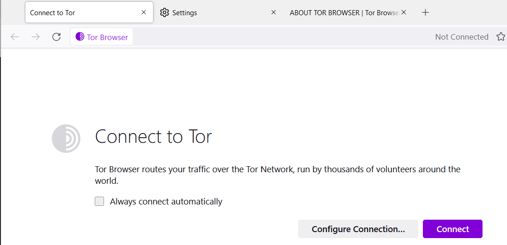

# h6 Onion

## Shavers & Bair 2016: Hiding Behind the Keyboard: The Tor Browser €; subchapters: "Introduction", "History and Intended Use of The Onion Router", "How The Onion Router Works", "Tracking Criminals Using TOR". (https://learning.oreilly.com/library/view/hiding-behind-the/9780128033524/XHTML/B9780128033401000021/B9780128033401000021.xhtml#s0010)

TOR (The Onion Router browser) is an Internet Browser built out of Firefox that hides IP address.
Why to use:
- to access web sites restricted or blocked by government in your country (if you can install TOR)
- anonymous contact of officials such as police

Here is from TOR Help page about the browser:
```
'Tor Browser uses the Tor network to protect your privacy and anonymity. Using the Tor network has two main properties:

  - Your internet service provider, and anyone watching your connection locally, will not be able to track your internet activity, including the names and addresses of the websites you visit.*

  - The operators of the websites and services that you use, and anyone watching them, will see a connection coming from the Tor network instead of your real Internet (IP) address, and will not know who you are unless you explicitly identify yourself.  

In addition, Tor Browser is designed to prevent websites from “fingerprinting” or identifying you based on your browser configuration.

By default, Tor Browser does not keep any browsing history. Cookies are only valid for a single session (until Tor Browser is exited or a New Identity is requested).'
```
TOR was developed by US government originally in 2002 and now they try to find a awy to deanonymize TOR's users

TOR uses several layers of encryption for disguising a user's internet traffic information, it sends it from a relay to a relay randomly (chooses random routes every 10 minutes) and encrypts information until it reaches the exit relay that connects to the final web site. 3 relays are used for the encryption: Entry, Middle and Exit relays, so information re-routed and encrypted 3 times, and last data is sent to the final address unencrypted. It means if a final receiver would try to understand where the message came from it will know the address of Exit router only.
These relays that allow encryption are users' computers, it is a community of volunteers that are part of the TOR's network. Anyone can make a server that will allow to encrypt the IP and send it to the next server until exit.

## a) Install TOR browser and access TOR network (.onion addresses). (Explain in detail how you installed it, and how you got access to TOR).

Downloaded from: https://www.torproject.org/download/
Download for Windows

Run: torbrowser-install-win64-11.5.8_en-US.exe

I used a default path for the installation.

TOR is run after installation complete.



Always connect automatically is kept Unticked

Going to settings to browse the options.

There is a way to set-up Bridges. Here is from TOR's help:

```
Bridges help you access the Tor Network in places where Tor is blocked. Depending on where you are, one bridge may work better than another.


Most Pluggable Transports, such as obfs4, rely on the use of "bridge" relays. Like ordinary Tor relays, bridges are run by volunteers; unlike ordinary relays, however, they are not listed publicly, so an adversary cannot identify them easily.

Using bridges in combination with pluggable transports helps to conceal the fact that you are using Tor, but may slow down the connection compared to using ordinary Tor relays.
```


