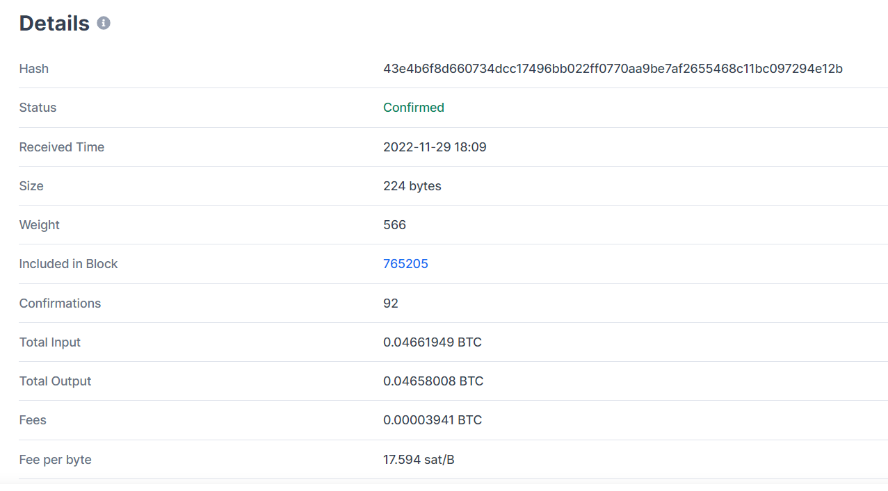
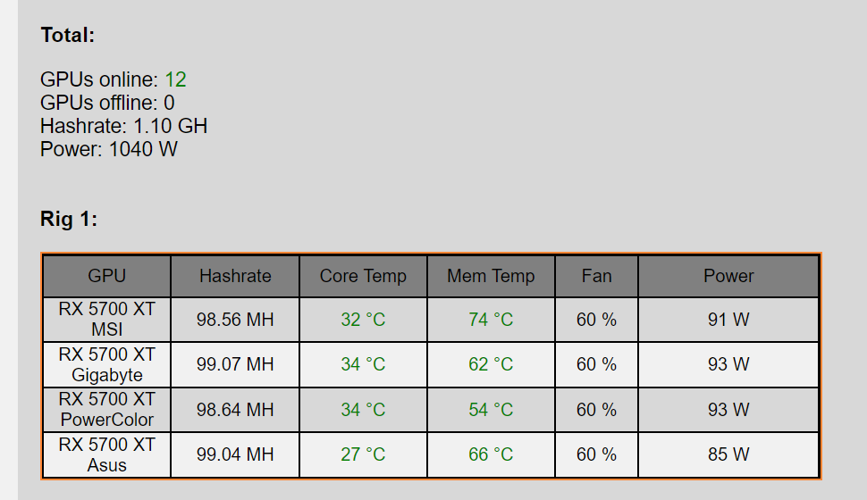

# h5 Detective CoinBit

## Summary of Felten et al 2015: Bitcoin and Cryptocurrency Technologies, videos Week 2 (https://www.coursera.org/learn/cryptocurrency/home/week/2)

Week 1 gave us introduction of cryptography and hash functions and digital signatures as critical elements of a block chain. Simple currencies are presented and drawbacks are discussed:
- with no control and double-spending 
- with control executed by one person (inventor of the currency) 

Week 2 gives more explanation how control on the transactions is implemented without giving a total power to separate people or organizations. Another topic that is discussed is how to motivate all participants to act honestly.

First part covers Decentralization and how it is implemented in BTC.

Bitcoin is a de-centralized ledger. These are critical characteristics that makes Bitcoin de-centralized:

- Peer-to-peer network. P2P network is a distributed application architecture, that consists of 2 or more connected computers that shares resources. This network forms an ecosystem where the computers are connected through a single server computer. (https://www.blockchain-council.org/blockchain/peer-to-peer-network/)
- Mining. Theoretically everybody can participate in mining and be an equal participant of the network
- SW update, ensures that proof-of-work happens within approximately the same period of time (every 10 mins) by re-adjusting algorithms based on power used in mining.

Distributed consensus is a decision making algorithm that bitcoin uses with own currency-related improvements. 
Here is how I understand its working. When a signed transaction happens it generates a new hash with pointers to the previous transactions, current signed transaction and receiver's public key. It is broadcasted to all nodes that are part of P2P network, and a right reliable random node should come up with an output or create a block that will be accepted by other peers by including this block in the chain. Including the new block into the chain verifies the transaction. The class suggests 6 blocks would be enough to fully confirm the validity of a transaction. It should be possible to read full history of transactions back to the original hash or genesis.

Another characteristics that is covered is the node identities. Bitcoin doesn't have any valid identities for participants that can be proven by any organization, this is one of critical feature of bitcoin transactions that they do not directly lead to any physical real- world address, or person. Of course some can analyze a list of transactions and understand who the real person behind the actions, but that can be done only when enough many activities are performed by the same node, what is not that easy. One of the way to identify the nodes is giving to them random ids or tokens, and this is how algorithm can know about the node and randomly call it and request a block for the transaction.

One of the problem is to motivate the participants to act honestly. and this leads to Mining as one of the characteristics of the fair game.
As Bitcoin also currency it introduces Financial incentives for the honest players.
Mining alows to earn Bitcoins money by finalizing a block of the chain that will be included then to the chain and becomes the longest.
This competition to earn money by using their computer power to finalize a block is allowing to ensure the fair game. Basically the achieved consensus will be converted into bitcoin money received by a node that is able to offer the block that is agreed by all participants and included into the longest chain of blocks.
How is a block finalized during mining? This is called Proof-of-work. The computer takes a hash with the signed trasnsaction, pointers to previous transactions and randomly add a nonce and generates different hashes. The target hash should contain the required amount of 0bits and should be small enough to fit the target space defined by the algorithm.

Algorithms are always adjusted to cover increased power of the participants, so that proof-of-work would be reached in approximately 10 mins between transactions. This brings us to the third characteristics of SW update.

## a) Detective Coinbit. Find and analyse a BitCoin transaction. Voluntary bonus: what else have the related parties done?

The source: https://www.blockchain.com/btc/tx/43e4b6f8d660734dcc17496bb022ff0770aa9be7af2655468c11bc097294e12b

*'This transaction was first broadcast to the Bitcoin network on November 29, 2022 at 6:09 PM GMT.  The transaction is currently unconfirmed by the network.  At the time of this transaction, 0.04658008 BTC was sent with a value of $762.66. The current value of this transaction is now $762.77.'*
The transaction wasn't yet confirmed by the time I checked, included in Block Mempool.
Input amount and output are different, my understanding this is done to pay a small fee for the validation
Total Input 0.04661949 BTC
Total Output 0.04658008 BTC

Next day I checked this transaction and I can see that it was confirmed. Ths is the update: (https://www.blockchain.com/btc/tx/43e4b6f8d660734dcc17496bb022ff0770aa9be7af2655468c11bc097294e12b)
*'This transaction was first broadcast to the Bitcoin network on November 29, 2022 at 6:09 PM GMT.  The transaction currently has **92 confirmations** on the network.  At the time of this transaction, 0.04658008 BTC was sent with a value of $762.67. The current value of this transaction is now $786.85.'*

These are details from the next day after the transaction was confirmed. Where we see how much was transferred, how much received and the Fee for thevalidation:

## b) Dashboard of Doom. Look at and comment Miko Hirvelä's crypto mining dashboard. Explain the current state of cryptocurrency mining. Relate your explanation to Miko's presentation and dashboard. What possible scenarios do you see for cryptocurrencies in the future?

Current view shows that Mikko's Revenue in 24hours is 1,69EURO, and the profit after deducting expenses is -0,95EURO

Mikkois mining ERGO, and how I understand the aim is to mine as much ERGO as possible no matter on the profit, as Mikko believes that this currency has future and might grow in the future.

These are the live stats from my mining pool called Herominers. The stats are updated once a minute via my python script.

*These numbers are important to know because my pool hashrate (how "fast" my GPUs are mining) is what I'm getting paid for. If the numbers are super low (less than 100 MH per rig for example), something is wrong. ERGO is just the crypto currency that I'm currently mining.*
Hashrates:

Rig_1: 536.76 MH
Rig_2: 820.28 MH
Combined now: 1.36 GH
Combined 24H: 1.17 GH

Then the dashboard is updating with the current status of the HW that Mikko is using. He gets current Hashrate and measure the temperature. The rig 1 showed hashrate <100 MH, as based on Mikko's explanaition something there worong:)

