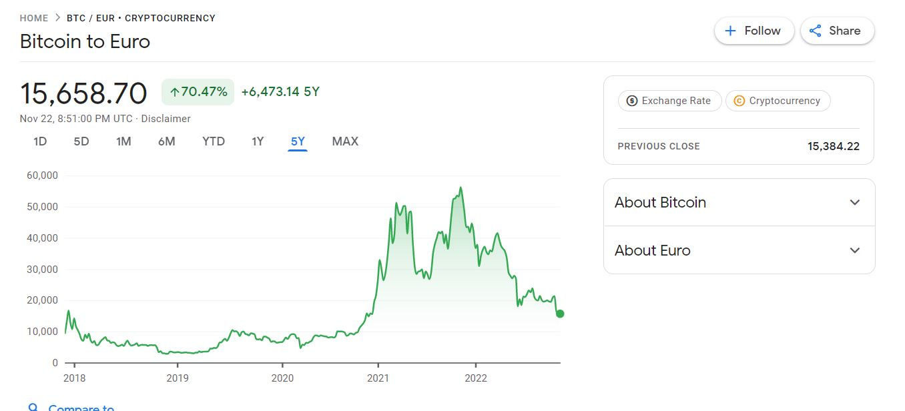
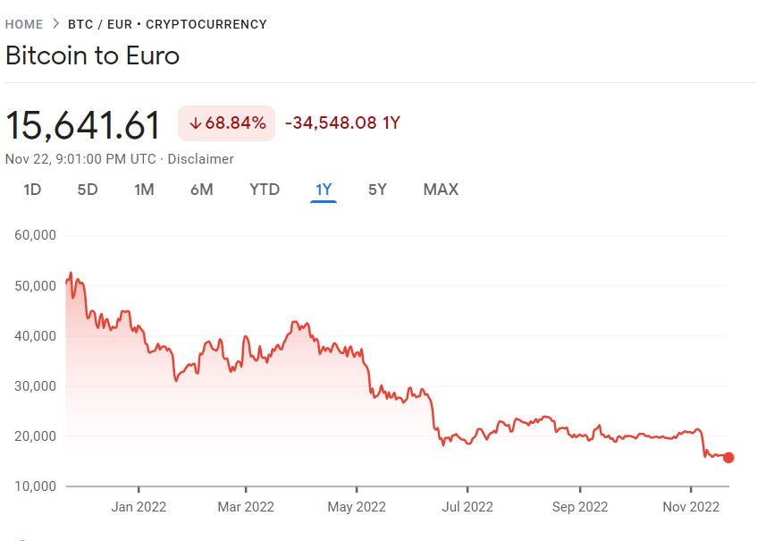

# h4 BitCoin intro

In the chapter Cryptographic Hash Functions of Bitcoin and Cryptocurrency Technologies (https://www.coursera.org/learn/cryptocurrency/home/week/1) 3 critical for cryptocurrency properties are listed. They are:

Collision-free or there is no real possibility with current coptuting resources to get the same hash value from 2 different messages. 

Next property is hiding or one-way hash is that there is no way to get original input from hash value. 

Above 2 properties allows us to verify that data are secured and weren't changed, and sender of the message is valid

Puzzle-friendly, that it is very difficult to get a hash with particular value. 

Electronic coin is defined as a chain of digital signatures by Nakamoto Satoshi (https://bitcoin.org/bitcoin.pdf) All transctions are digitally verified by a payer by signing a hash of the previous transaction and the public key of the next owner and adding this data to the end of the coin. Receiver can verify the signature and that data a valid and not changed or chain of ownership.

One of the isue that cryptocurrency should solve is double-spending. BitCoin solves this issue by giving full history of changes to all participants. 

A) How much is one BitCoin (BTC) worth now? Using historical BTC course, show that you could have lost a lot of money investing in BTC. Also show that you could have won a lot of money with BTC.

The current price of BitCoin is 15 672,03EUR checked 22.11.2022 (https://www.google.com/finance/quote/BTC-EUR)
(https://coinmarketcap.com/currencies/bitcoin/)

Buying BTC 5 years ago and selling now would bring us profit 70%:

Buying BTC 1 year ago and selling now woud end up in th loss of 68%:

B) Blockchain in Olga's interpretation: unbreakable chain of hashes where following always encodes preceeding

c) Not BitCoin. Give examples of some AltCoins, crypto currencies compiting with BitCoin. For each AltCoin: how does it differ, what's it's claim for fame?

It is 20000 cryptocurrencies recorded in July 2022. (https://explodingtopics.com/blog/number-of-cryptocurrencies)

Ethereum (CRYPTO:ETH), currency Ether. Etherium wasn't developed as a curency but as a as a platform to facilitate immutable, programmatic contracts and applications via a global virtual machine. Ether is the native currency of the Etherium Network. 
Ethereum proposed to use blockchain technology not only for maintaining a decentralized payment network but also for storing computer code that can be used to power tamper-proof decentralized financial contracts and applications.(https://www.investopedia.com/articles/investing/031416/bitcoin-vs-ethereum-driven-different-purposes.asp)

Tether (CRYPTO:USDT) - A stablecoin that follows the U.S. dollar and the cryptocurrency with the most trading volume. (https://www.fool.com/investing/stock-market/market-sectors/financials/cryptocurrency-stocks/how-many-cryptocurrencies-are-there/) Stablecoins are currency that is supported by assets, and cannot drop lower than a physical asset that supports and stabilizes them. (https://en.wikipedia.org/wiki/Stablecoin)

i) Voluntary: When do you have to pay taxes for BitCoin in Finland? (If you want, you can instead check taxation in another country)

My undestnding is that tax on cryptocurrency follows the tax on capital. Capital tax on profit to be paid when cryptocurrency is sold or exchanged.
Update after Mikko's presentation: Taxes from all crypto, on top to pay taxes on profit during selling. Tax deduction for HW and equipment

